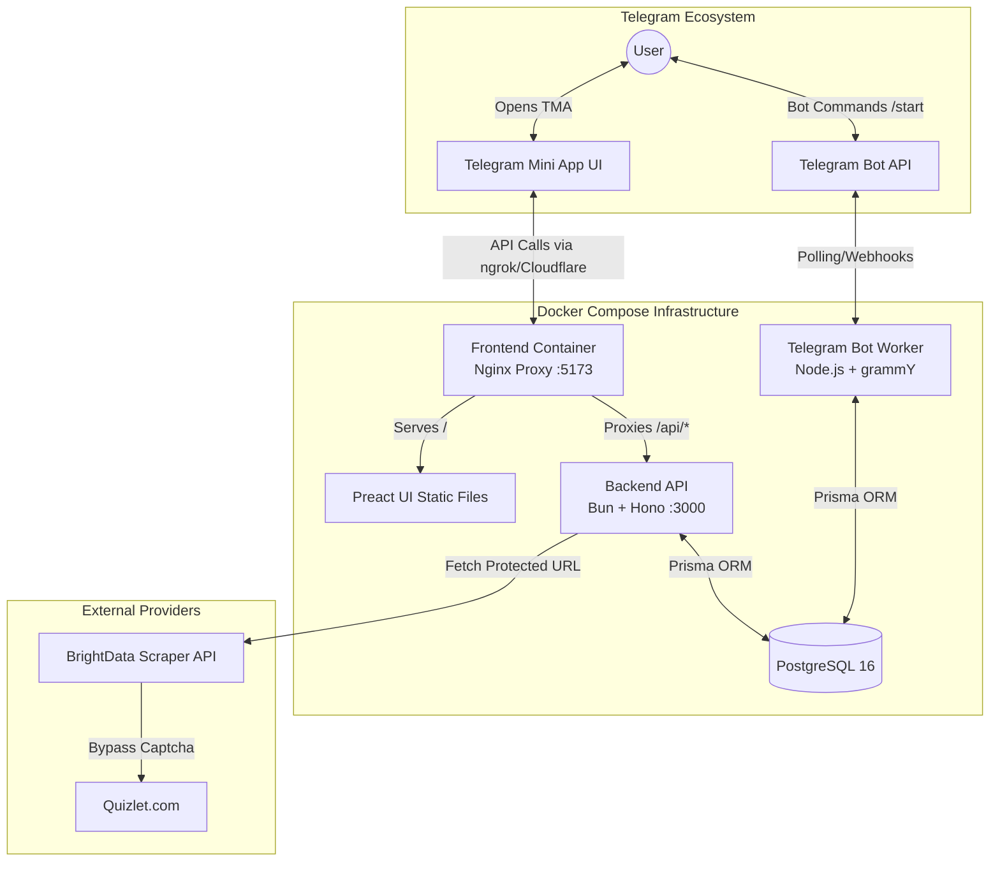
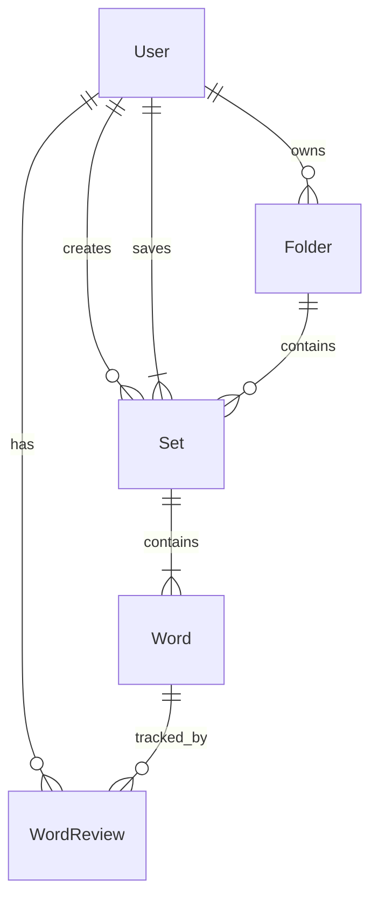

# Quizlet Telegram Bot & Mini App

A comprehensive solution to learn and study Quizlet sets directly inside Telegram. It features a fully functional Telegram Bot for spaced-repetition notifications and a modern, Telegram Mini App (TMA) for an enhanced graphical user interface.

---

## 🏗 System Architecture

The project consists of 4 main services orchestrated via Docker Compose:

---

## 📦 Services Overview

### 1. `app` (The Main Telegram Bot)
- **Tech Stack:** Node.js, `grammY`, Prisma, TypeScript.
- **Responsibility:**
  - Handles basic Telegram commands (e.g., `/start`).
  - Sends spaced-repetition notifications (cron jobs) with words to review based on user settings (interval, batch size, quiet hours).
  - Processes inline keyboard callbacks (e.g., "Mark as Learned").

### 2. `frontend` (Telegram Mini App GUI)
- **Tech Stack:** Preact, Vite, Tailwind CSS, `lucide-preact`, `@twa-dev/sdk`.
- **Responsibility:**
  - Provides a beautiful, glassmorphism-inspired UI designed to match Quizlet's aesthetics.
  - Automatically adapts to the user's Telegram theme (Dark/Light mode).
  - Displays progress rings, statistics, and a settings dashboard.
  - Form to add new Quizlet sets.
- **Serving:** Built as static files and served using an **Nginx** reverse proxy. Nginx also proxies all requests starting with `/api/` directly to the `backend` container, allowing both to live on **one domain**.

### 3. `backend` (API & Scraper)
- **Tech Stack:** Bun, Hono, Prisma, Cheerio, TypeScript.
- **Responsibility:**
  - Serves as the API for the Frontend Mini App.
  - Handles Telegram Mini App Authentication (verifying `X-Telegram-Init-Data` via HMAC-SHA256).
  - Executes the heavy lifting of scraping Quizlet links (`/api/scrape`) via BrightData.
  - Parses Quizlet's HTML/JSON-LD data to extract terms and definitions.

### 4. `db` (Database)
- **Tech Stack:** PostgreSQL 16
- **Responsibility:** Centralized data storage for Users, Folders, Sets, Words, and WordReviews, shared by both the `app` and `backend`.

---

## 🗄 Database Schema

---

## 🚀 Deployment & Development Workflow

The environment configuration is designed to easily switch between local development and production. All configurations reside in the `.env` file.

### Setting up the Environment
Edit the `.env` file in the root directory.

#### For Local Development:
1. Uncomment the `DEVELOPMENT` block in `.env`.
2. Start an `ngrok` tunnel to expose your local frontend: `ngrok http 5173`.
3. Update `WEBAPP_URL` in `.env` with your dynamic ngrok HTTPS link.
4. Set your development `BOT_TOKEN` in `.env`.
5. Run `docker compose up --build -d`.
6. Open your Dev Bot in Telegram and press "Start".

#### For Production (e.g., Raspberry Pi + Ubuntu Server):
1. Comment out the `DEVELOPMENT` block and uncomment the `PRODUCTION` block in `.env`.
2. Set your production `BOT_TOKEN`.
3. Set your `WEBAPP_URL` to your fixed Cloudflare Tunnel domain (e.g., `https://quizlet-bot.yourdomain.com`).
4. Ensure Cloudflare Tunnel points exactly to port `5173` on your Raspberry Pi.
5. Setup the infrastructure: `docker compose up --build -d`.

### Why Nginx?
We bundle Nginx directly inside the `frontend` container to solve Cross-Origin Resource Sharing (CORS) and complexity. Because Nginx listens on port `80` (mapped to `5173` locally) and routes `/api/*` to the Bun backend (`http://backend:3000`), the frontend app makes relative API requests (`fetch('/api/user')`), eliminating the need for complex multi-domain SSL certificates or dynamic `VITE_API_URL` build arguments.

---

## 🔑 Authentication Security

The backend securely authenticates users visiting the Mini App without requiring a login screen:
1. When the user opens the Mini App, Telegram injects a cryptographic signature (`initData`).
2. The Preact frontend sends this signature via the `X-Telegram-Init-Data` HTTP header.
3. The Bun Hono backend validates this signature against your `BOT_TOKEN` using `HMAC-SHA256`.
4. Once verified, the backend extracts the `telegramId`, finds the user in PostgreSQL, and serves their protected data securely.